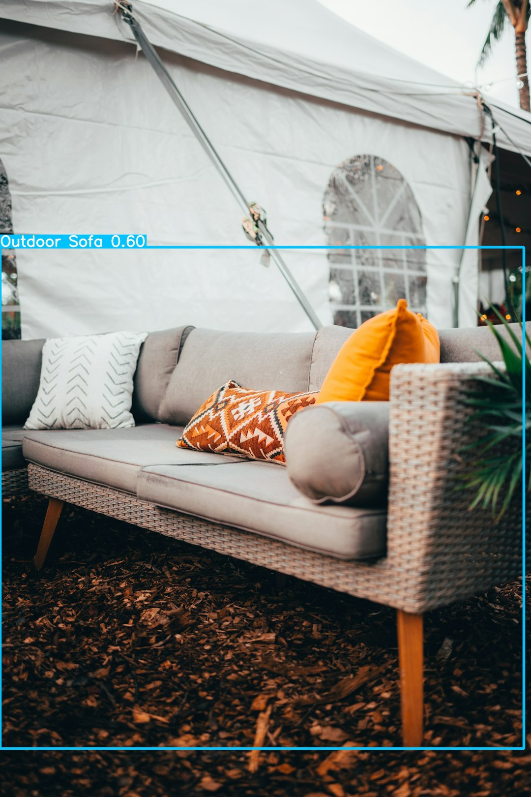
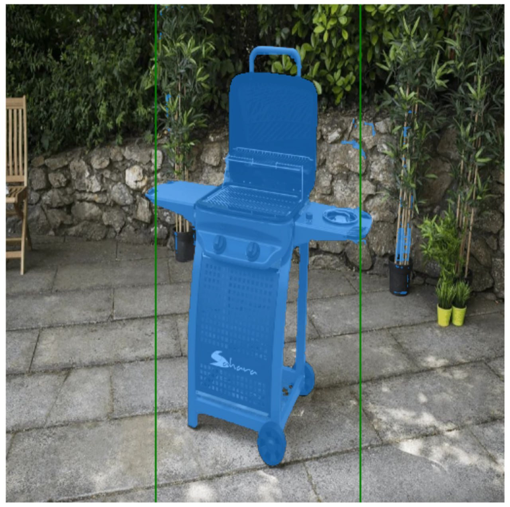

# U-Retouch

[](https://drive.google.com/file/d/1ku-F_2BHtlg9ZDVGXyMSgLa9ucnyOVfZ/view?usp=sharing]

Платформа для визуализации товара на релевантных фонах.

Доступна [здесь](https://uretouch.shaligula.ru) до тех пор, пока работает Yandex Cloud.

Docker-Compose Build Test - [здесь](https://github.com/zloishavrin/uretouch/actions).

# Оглавление

- [U-Retouch](#u-retouch)
  - [Нейронная сеть](#нейронная-сеть)
    - [YOLOv5](#yolov5)
    - [SAM](#sam)
    - [Stable Diffusion](#stable-diffusion)
  - [Описание платформы](#описание-платформы)
  - [Запуск платформы](#запуск-платформы)
    - [Локальные переменные](#локальные-переменные)
    - [ML](#ml)
    - [Frontend](#frontend)
    - [Мобильное приложение](#мобильное-приложение)
    - [Backend](#backend)
    - [Документация](#документация)
    - [Панель управления базой данных](#панель-управления-базой-данных)
    - [TG-Bot](#tg-bot)

## Нейронная сеть

Для генерации итогового изображения используется три модели нейронных сетей. 

Готовый Google Collab с генерацией - [здесь](https://drive.google.com/file/d/1ku-F_2BHtlg9ZDVGXyMSgLa9ucnyOVfZ/view?usp=sharing).

### YOLOv5



YOLOv5 используется для выделения BOX-рамки с предметами мебели на фото.

### SAM



SAM используется для сегментации и выделения предмета мебели. Для этой задачи полезно то, что на предыдущем шаге YOLOv5 выделяет BOX-рамки с предметами мебели на фото - так лучше проходит сегментация.

### Stable Diffusion


В Stable Diffusion передается маска созданная с помощью сегментации (SAM) и заготовленные промпты (готовые режимы) или свой кастомный промпт. Stable Diffusion генерирует фон для изображения.

## Описание платформы

Веб-платформа написана на стеке MERN (MongoDB + ExpressJS + ReactJS + NodeJS). Написана система аутентификации, которая использует JWT-аутинтификацию (Access и Refresh токены). Затем готовый билд клиентской части хостится на NGINX-сервере. Регистрация в веб-платформе происходит через подтверждение аккаунта по почте (настроен SMTP).

Разработано мобильное приложение на Kotlin, которое работает с Backend-частью веб-платформы. Отличительной особенностью мобильного приложения является возможность сразу сфотографировать мебель прямо в приложении и сразу же отправить на генерацию.

## Запуск платформы

Сервисы объединены в Docker-композицию. Для запуска понадобится Docker Dekstop (Windows, MacOS) или Docker + Docker-Compose (Linux).

Запуск выполняется следующей командой:

```bash
docker-compose up --build
```

Для того, чтобы выключить необходимо нажать CTRL+C, а затем ввести:

```bash
docker-compose down
```

### Локальные переменные

Перед запуском необходимо создать в корне проекта ENV-файл (или установить вручную переменные окружения).

|Переменная|Обозначение|
|-|-|
|MONGO_ROOT_USER|Пользователь для базы данных|
|MONGO_ROOT_PASSWORD|Пароль для пользователя базы данных|
|MONGOEXPRESS_LOGIN|Пользователь для панели управления базой данных|
|MONGOEXPRESS_PASSWORD|Пароль для пользователя панели управления базой данных|
|API_URL|URL для доступа к API|
|CLIENT_URL|URL для доступа к клиенту|
|JWT_ACCESS_SECRET|Секретный ключ для токенов доступа JWT-аутентификации|
|JWT_REFRESH_SECRET|Секретный ключ для токенов обновления JWT-аутентификации|
|SMTP_SERVICE|Название сервиса для SMTP-протокола|
|SMTP_USER|Пользователь для SMTP-сервиса|
|SMTP_PASSWORD|Пароль пользователя SMTP-сервиса|
|YANDEX_TRANSLATE_API_KEY|API-ключ для Яндекс.Translate|
|BOT_TOKEN|API-ключ от телеграм-бота (BotFather)|

Пример ENV-файла:

```
MONGO_ROOT_USER=admin
MONGO_ROOT_PASSWORD=admin
MONGOEXPRESS_LOGIN=admin
MONGOEXPRESS_PASSWORD=admin
API_URL='http://localhost:3001/'
CLIENT_URL='http://localhost/'
JWT_ACCESS_SECRET='example1'
JWT_REFRESH_SECRET='example2'
SMTP_SERVICE='gmail'
SMTP_USER='example@gmail.com'
SMTP_PASSWORD='exam plee xamp leex'
YANDEX_TRANSLATE_API_KEY='exam plee xamp leex'
BOT_TOKEN='exam plee xamp leex'
```

### ML

ML-сервис использует FastAPI для создания API, к которому идет запрос с **Backend**. Может запускаться и отдельно, и на сервере с Backend (прописан Dockerfile).

В данный момент хостится на Yandex Cloud отдельно от Backend+Nginx.

### Frontend

React-проект находится в директиве **client** и запускается на порту 3000 на localhost.

Для установки зависимостей необходимо прописать зависимость в package.json и перезапустить Docker-композицию. Устанавливать в node_modules ничего не надо.

Чтобы посмотреть, как будет выглядеть готовый билд, можно закинуть файлы билда в **static_client** и открыть localhost на HTTP/HTTPS порту.

### Мобильное приложение

Более подробная инструкция о билде мобильного приложения [здесь](https://github.com/zloishavrin/uretouch/blob/master/mobile/README.MD).

### Backend

Находится в директиве **backend** и запускается на порту 3001 на localhost.

Частично покрыт тестами на Jest.

К серверу можно обратиться через **localhost/api/** по HTTP-порту.

Например, с фронтенда (веб):
```javascript
useEffect(() => {
axios.post('http://localhost/api/auth/login')
    .then(response => {
        console.log(response.data);
    })
    .catch(error => {
        console.error(error.response.data.message);
    });
}, []);
```

### Документация

Документация можно открыть по localhost/swagger/ по HTTP или HTTPS-порту при запуске Docker-композиции.

Также документация доступна [здесь](https://uretouch.shaligula.ru/swagger/).

### Панель управления базой данных

Можно посмотреть, что происходит в базе данных в панели управления. Она доступна на localhost на порту **8888**.

### TG-Bot

Телеграм-бот находится в папке **bot** и является примером интеграции с публичным API, который предоставляет **Backend**. Каждому пользователю в веб-версии приложения предоставляется API-ключ, который затем можно использовать для доступа к генерации.

Пример интеграции с публичным API:
```javascript
async startGeneration(prompt, mode, fileUrl) {
    const photoResponse = await axios({
        url: fileUrl,
        responseType: 'stream'
    });

    const localFilePath = './photo/photo.jpg';
    const writer = fs.createWriteStream(localFilePath);

    photoResponse.data.pipe(writer);

    await new Promise((resolve, reject) => {
        writer.on('finish', resolve);
        writer.on('error', reject);
    });

    const form = new FormData();
    if (prompt) {
        form.append('prompt', prompt);
    } else if (mode) {
        form.append('mode', mode);
    }
    form.append('image', fs.createReadStream(localFilePath));

    const response = await axios.request({
        method: 'POST',
        url: 'https://uretouch.shaligula.ru/api/generation/public',
        headers: {
            "Authorization": `Bearer ${process.env.BOT_SERVICE_API_KEY}`,
            ...form.getHeaders()
        },
        data: form
    });
    fs.unlinkSync(localFilePath);
    return response.data.generation_id;
}
```
